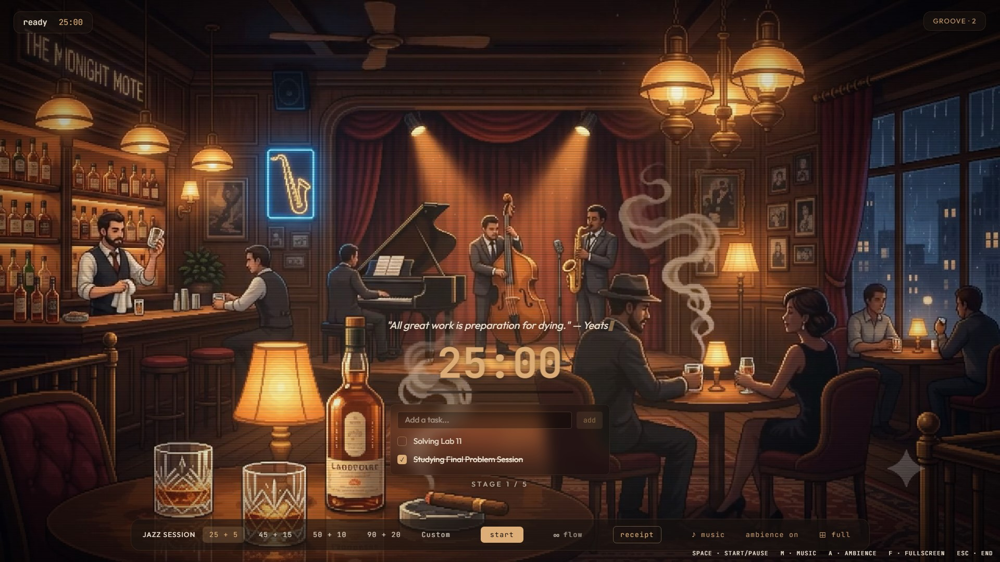
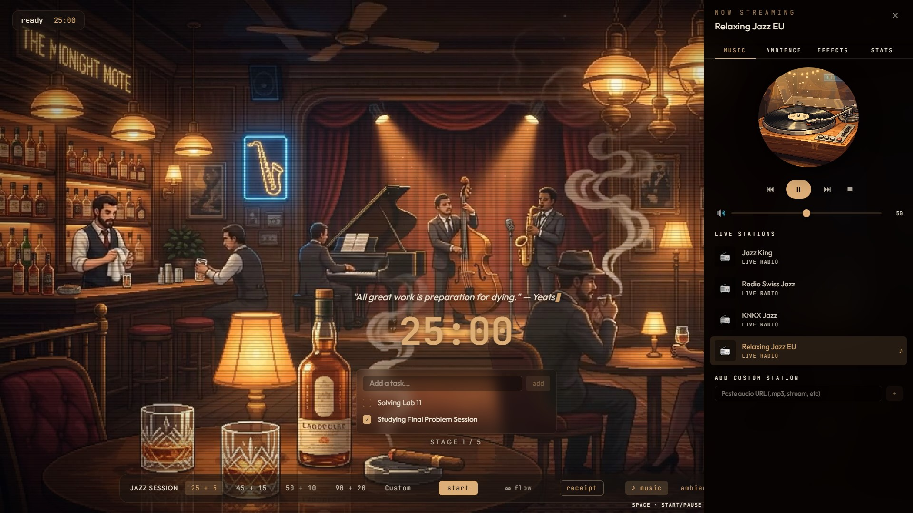
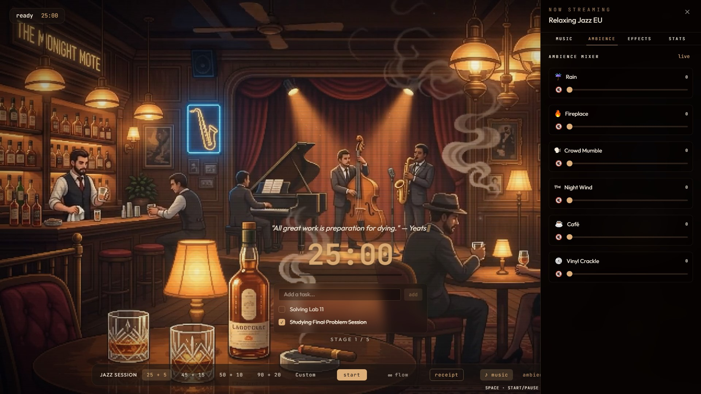

<div align="center">

# 🎷 JAZZ BAR

### *A Late-Night Lounge for Deep Focus*

*Rain tapping against the window. A vinyl record spinning softly. The fireplace crackling in the corner. One more task before closing time.*

<br>





<br><br>


<br>

### 🍷 Productivity shouldn't feel like work.

</div>

---

## 🌙 The Story

Most productivity apps feel like spreadsheets wearing a timer.

**Jazz Bar** takes a different approach.

It's a digital jazz lounge built for people who focus better when the atmosphere feels alive.

Instead of cold dashboards and endless notifications, you get:

- 🎹 Soft jazz drifting through the room
- 🌧️ Rain rolling across the windows
- 🔥 A warm fireplace in the background
- 🥃 A cozy pixel-art bar slowly coming to life

Open the app, disappear into the music, and let the hours melt away.

---

## ✨ What Makes It Special

### 🎷 Live Jazz Atmosphere

Transform your workspace into a cozy late-night bar.

Every visual element is designed to create calm, focus, and immersion.

---

### 🎵 Built-In Jazz & Lo-Fi Radio

No need to open Spotify.

Switch between carefully selected stations and let the music carry your session.

---

### 🌧️ Dynamic Ambience Mixer

Build your perfect environment.

Mix and match:

- Rain
- Fireplace
- Bar chatter
- Ambient room noise

Each sound has its own volume control.

---

### ⏳ Beautiful Focus Sessions

Work and break cycles flow naturally through the experience.

No harsh interruptions.

Just smooth transitions and subtle visual feedback.

---

### 🌙 Zen Mode

Press **Z** and everything fades away.

No menus.

No buttons.

No distractions.

Just you, the music, and the timer.

---

### 🧾 Daily Receipt

Every day ends with a receipt from the bar.

Track:

- Focused minutes
- Sessions completed
- Daily productivity streaks

A small ritual that makes progress feel rewarding.

---

### 📱 Install Like a Native App

Available anywhere.

Desktop. Laptop. Tablet. Phone.

One click and Jazz Bar lives on your device.

---

## 🚀 Getting Started

### Clone

```bash
git clone https://github.com/madireis/jazz-bar.git
cd jazz-bar
```

### Install

```bash
npm install
```

### Start

```bash
npm run dev
```

Open:

```text
http://localhost:8080
```

Pour yourself a drink.

The lounge is open.

---

## ⌨️ Controls

| Key | Action |
|------|---------|
| `Space` | Start / Pause Session |
| `Z` | Toggle Zen Mode |
| `M` | Open Music Picker |
| `A` | Toggle Ambience |
| `F` | Fullscreen |
| `Esc` | End Session |

---

## 🛠 Built With

```txt
⚛ React 19
⚡ Vite
🎨 Tailwind CSS v4
🧭 TanStack Router
🔊 Custom Audio Engine
📱 Progressive Web App
```

---

## 🎯 Perfect For

```txt
☕ Students
💻 Developers
📝 Writers
🎨 Designers
📚 Researchers
🌙 Night Owls
```

---

<div align="center">

## 🎺 Last Call

*"The rain keeps falling."*

*"The record keeps spinning."*

*"Your work keeps moving."*

### Welcome to Jazz Bar.

🍷 🎷 🌧️ 🔥

</div>
