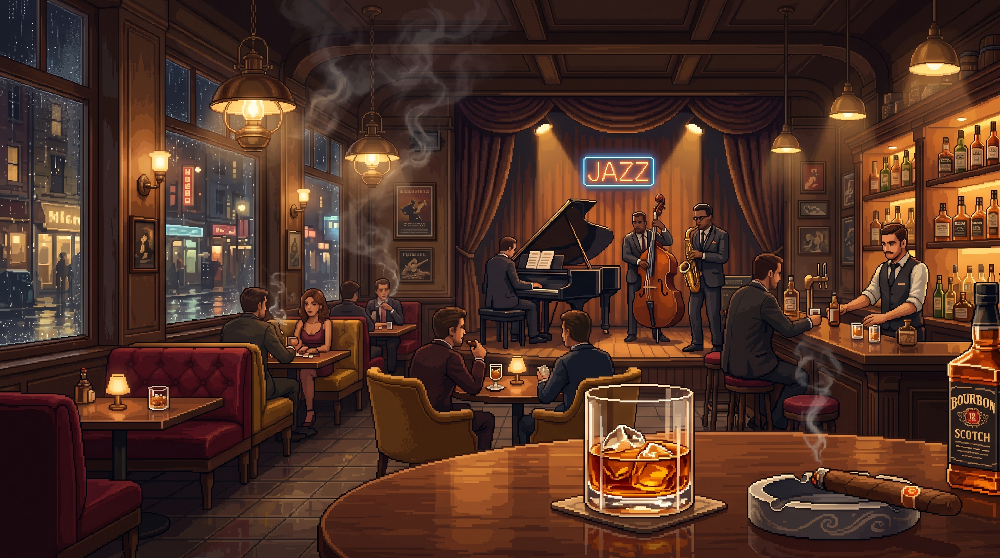

<div align="center">
  
  
  <h1>🎷 Jazz Bar — A Cozy Focus Lounge</h1>
  
  <p>
    <strong>A browser-based focus app themed as a cozy pixel-art jazz lounge.</strong>
  </p>
  
  <p>
    <a href="#features">Features</a> •
    <a href="#installation">Installation</a> •
    <a href="#usage">Usage</a> •
    <a href="#tech-stack">Tech Stack</a>
  </p>
</div>

---

## 🥃 Welcome to the Lounge

**Jazz Bar** is an immersive productivity tool designed to help you enter deep work without the clinical, sterile feel of traditional Pomodoro timers. Sit back, pick your favorite jazz track, let the ambient rain and fireplace crackle, and watch your bar slowly come to life as you focus.

### ✨ Features

- **Immersive Environment**: Beautiful pixel-art background loop that reacts to your session.
- **Layered Ambience Engine**: Mix your perfect background noise. Adjust the volume of the crackling fireplace, the pouring rain, and the low murmur of the bar independently.
- **Integrated Music Player**: Built-in curated lo-fi and jazz tracks to keep you in the zone.
- **Dynamic Session Phases**: Fluidly transitions between Work and Break phases, updating the on-screen "stage" and visualizer particles.
- **Zen Mode**: Press `Z` to hide all UI elements except the timer and immerse yourself completely in the environment.
- **Daily Receipt**: A beautiful glassmorphic modal that tracks your session history, displaying tasks completed and total deep work minutes accumulated.
- **PWA Ready**: Installable directly to your desktop or mobile device as a Progressive Web App for a native, distraction-free experience.

## 🚀 Installation

Jazz Bar is built with Vite, React, and TanStack Router.

1. **Clone the repository**
   ```bash
   git clone https://github.com/yourusername/jazz-bar.git
   cd jazz-bar
   ```

2. **Install dependencies**
   ```bash
   npm install
   ```

3. **Start the lounge**
   ```bash
   npm run dev
   ```
   *The app will be available at `http://localhost:5173`.*

## ⌨️ Shortcuts

Navigate the bar without reaching for your mouse:

| Key | Action |
| :--- | :--- |
| `Space` | Start or Pause the current session |
| `Z` | Toggle **Zen Mode** (hides all UI) |
| `M` | Open the Music Picker |
| `A` | Toggle Ambience (Mute/Unmute all ambient sounds) |
| `F` | Toggle Fullscreen mode |
| `Esc` | End the current session |

## 🛠️ Tech Stack

- **Framework**: [React 19](https://react.dev/)
- **Routing**: [TanStack Router](https://tanstack.com/router/latest)
- **Styling**: [Tailwind CSS v4](https://tailwindcss.com/) with custom Glassmorphism utilities
- **Build Tool**: [Vite](https://vitejs.dev/)
- **Audio Engine**: Custom HTML5 Audio pooling architecture for gapless looping

---
<div align="center">
  <i>Stay focused. Stay cozy.</i>
</div>
